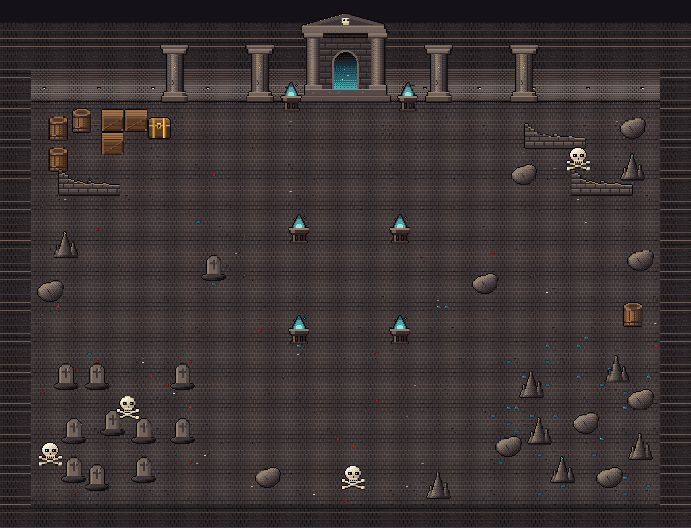
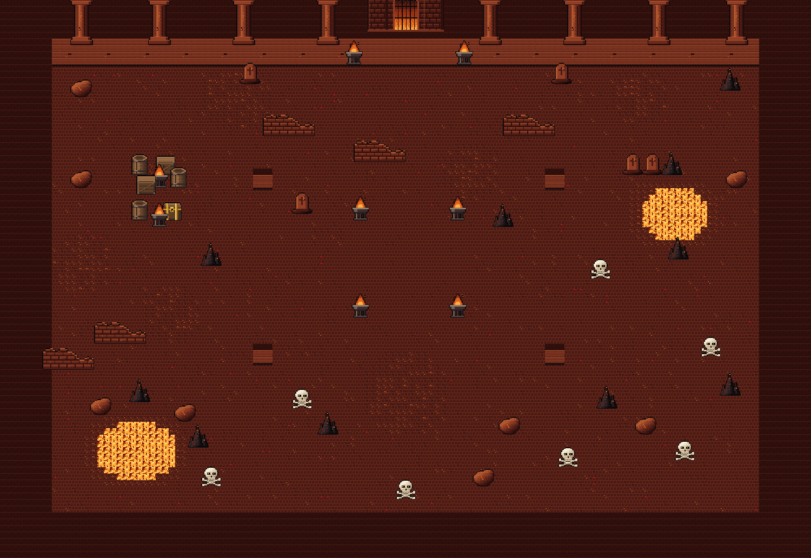
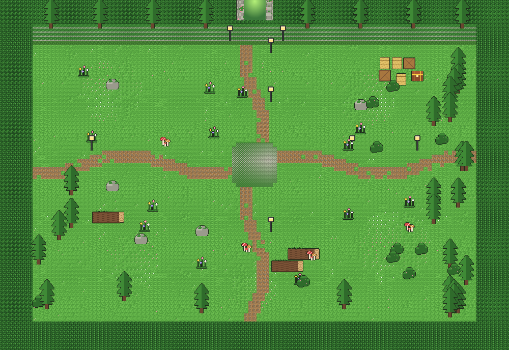
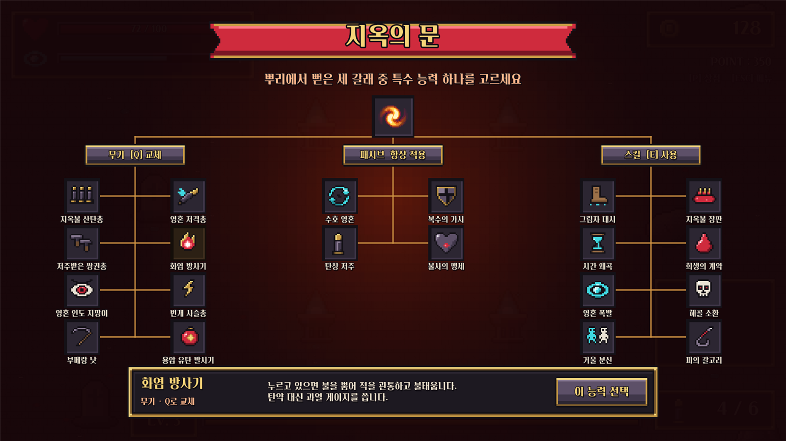

<div align="center">

# 🕯️ 민근이의 첫번째 게임

**지하 묘역에서 지옥을 지나 초원까지, 끝없이 몰려오는 적을 쏘아 쓰러뜨리는 탑다운 2D 슈팅 서바이벌**


  

<sub>▲ 1장 지하 묘역 · 2장 불타는 지옥 · 3장 초원</sub>

</div>

---

## 📖 소개

사방에서 적이 몰려드는 **지하 묘역**에서 리치 왕을 쓰러뜨리면 **불타는 지옥**이, 지옥의 군주를 쓰러뜨리면 **초원**이 열립니다.
적을 처치해 경험치와 코인을 모으고, **레벨업 능력** · **떠돌이 상점** · **특수 능력**으로 캐릭터를 키워
세 스테이지의 보스를 모두 쓰러뜨리세요.

## ✨ 주요 특징

| | |
|---|---|
| 🔫 **리볼버 사격** | 마우스로 조준하는 8연발 사격. 탄창이 비면 자동 재장전 |
| 🎯 **타겟팅 스킬** | 시간이 지나면 차는 게이지로 적을 조준 → **들고 있는 무기마다 전혀 다른 필살기** |
| 🗺️ **세 개의 스테이지** | 1장 지하 묘역 → 2장 불타는 지옥 → 3장 초원 (모두 넓은 맵, 통과 가능한 장식만) |
| ⚠️ **피할 수 있는 스킬** | 적마다 점프 · X자 레이저 · 장판 등 서로 다른 스킬, 전부 **경고 표시 후 발동** |
| 👑 **보스전** | 리치 왕 · 지옥의 군주 · 분열하는 킹 슬라임, 각자 스킬 3개 + 체력 절반 아래 특수 스킬 |
| 🌳 **특수 능력 20종** | 무기 · 스킬 · 패시브를 스킬 트리에서 고르고, 중간 보스 보상으로 **진화** |
| 🎨 **도트 이펙트** | 폭발 · 번개 · 레이저 · 룬 마법진 · 화염 회오리 등 직접 그린 도트 이펙트 18종 |
| 🛒 **떠돌이 상점** | 적 10마리마다 나타나는 상점 제단에 10초 안에 다가가야 쇼핑 |

## 🎮 조작법

| 입력 | 동작 |
|:---:|---|
| `W` `A` `S` `D` / 방향키 | 이동 |
| 🖱️ 좌클릭 | 마우스 방향으로 사격 |
| 🖱️ 우클릭 (누르고 있기) | 타겟팅 스킬 — 떼면 필살기 (게이지가 가득 찼을 때) |
| `R` | 들고 있는 무기 재장전 |
| `Q` | 무기 교체: 기본 권총 → 특수 무기1 → 특수 무기2 … |
| `E` / `F` / `Space` | 특수 스킬 1 / 2 / 3 — 대시·장판·갈고리는 누르고 있으면 미리보기, 떼면 발동 |
| `T` | 특수 강화 (특수 능력 포인트가 있을 때) |
| 레벨업 창 | 카드를 **클릭**해서 고르고 **`Space`**로 확정 |
| `ESC` | 일시정지 메뉴 / 상점 닫기 |

## 🖥️ 화면 구성

- **왼쪽 위**: 체력 · 스킬 게이지 (적을 잡으면 잠깐 밝게 빛나며 빨리 참), 획득한 레벨업 능력 아이콘
- **오른쪽 위**: 코인 · 점수
- **오른쪽 아래**: 탄약, 화살표로 여닫는 능력치 창
- **왼쪽 아래**: 특수 능력 창 세 개 — **무기**(기본 권총 포함, 탄창 · 장전), **스킬**(키 · 쿨타임), **패시브**
- **아래**: 레벨 · 경험치 바, 특수 능력 포인트가 있으면 반짝이는 **특수 강화** 버튼
- **피격**: 화면 가장자리가 붉게 번쩍이며 흔들리고 피해 숫자가 뜸, 체력 30% 아래면 붉게 맥박

## ⚔️ 게임 시스템

> 적은 플레이어에게 닿으면 자폭하며 피해를 주고, 맞은 뒤 0.8초 동안은 무적입니다.
> 보스를 뺀 적은 **최대 20마리**까지만 동시에 나옵니다.
> 모든 적과 보스의 스킬은 **빛나는 경고 원 · 선, 바닥의 룬 마법진, 좁혀 드는 타이밍 고리, 머리 위 `!`**로 미리 알려줍니다.

### 1장 · 지하 묘역

| 적 | 체력 | 접촉 피해 | 스킬 |
|---|:---:|:---:|---|
| 💀 해골 | 3 | 5 | 없음 (첫 적) |
| 🧟 구울 | 8 | 8 | **도약 강타** — 떨어질 곳에 원을 띄운 뒤 높이 뛰어 내려찍음 |
| 👻 망령 | 16 | 12 | **영혼 순간이동** — 보라색 원으로 사라졌다 나타나며 영혼 폭발 |

| 단계 | 조건 | 등장 비율 (해골 : 구울 : 망령) |
|:---:|---|---|
| 1 | 시작 | 100 : 0 : 0 |
| 2 | 20마리 처치 | 45 : 55 : 0 |
| 3 | 40마리 처치 | 25 : 35 : 40 |
| 👑 | 60마리 처치 | 신전 문에서 **리치 왕** 등장 |

리치 왕을 쓰러뜨리면 **신전 문에 포탈이 열리고**, 들어가면 특수 능력 3개를 고른 뒤 2장으로 넘어갑니다.
**30초 안에 들어가지 않으면** 마지막 8초 동안 문 쪽으로 점점 세게 끌려가고, 시간이 다 되면 자동으로 들어갑니다.

### 2장 · 불타는 지옥

| 적 | 체력 | 접촉 피해 | 스킬 |
|---|:---:|:---:|---|
| 😈 임프 | 14 | 10 | **X자 레이저** — 플레이어 자리에 X자 경고 뒤 엇갈리는 화염 레이저 |
| 🔥 불꽃 해골 | 26 | 13 | **자폭** — 가까이 오면 부풀어 오르다 화염 폭발 |
| 🐺 지옥견 | 30 | 14 | **돌진** — 붉은 경로를 보여준 뒤 먼지를 일으키며 달려듦 |
| 🪨 용암 골렘 | 110 | 22 | **3연속 지면 파동** — 점점 넓어지는 세 번의 충격파와 솟는 가시 |
| ⚔️ 악마 기사 | 75 | 24 | **회전 베기** — 칼날을 휘감고 회전하며 플레이어 쪽으로 미끄러짐 |

단계는 15 · 30 · 45 · 60마리마다 오르고, 80마리를 처치하면 **지옥의 군주**가 나옵니다.
지옥의 군주를 쓰러뜨리면 성문이 다시 열리고, 들어가면 **특수 능력 포인트 2개**를 받고 3장으로 넘어갑니다 (30초 뒤 자동 입장).

### 3장 · 초원

| 적 | 체력 | 접촉 피해 | 스킬 |
|---|:---:|:---:|---|
| 🟢 초원 슬라임 | 22 | 13 | **산성 웅덩이** — 밟으면 아픈 산성 웅덩이를 남김 |
| 🐝 거대 벌 | 28 | 14 | **꽃가루 구름** — 안에 있으면 느려지고 조금씩 아픈 구름 |
| 🍄 버섯 괴물 | 45 | 16 | **버섯 지뢰** — 주변에 버섯을 심고 차례로 터뜨림 |
| 🐺 회색 늑대 | 40 | 17 | **울부짖음** — 주변 적이 잠시 빨라짐 |
| 🌳 나무 정령 | 130 | 26 | **뿌리 가시 행렬** — 플레이어 쪽으로 가시가 차례로 솟아오름 |

단계는 2장과 같고, 80마리를 처치하면 **킹 슬라임**이 나옵니다.

#### 👑 보스 스킬

보스는 스킬 3개를 번갈아 쓰고, **체력이 절반 아래로 떨어지면 특수 스킬**을 추가로 씁니다. 모두 투사체 없이 경고 뒤에 발동해요.

| 보스 | 스킬 | 특수 스킬 (체력 50% 미만) |
|---|---|---|
| 👑 리치 왕 | **망령의 손아귀** 세 겹 고리에서 차례로 영혼의 손이 솟음 · **저주 표식** 주변 5곳 폭발 · **뼈 가시 격자** + 모양 뒤 × 모양으로 뼈 가시 | **망자의 의식** 룬 고리를 그리고 영혼 등불 넷이 돌며 **회전 레이저** → 대폭발과 가시 고리 |
| 👑 지옥의 군주 | **화염 돌진** · **운석 낙하** 도트 운석 7개 · **화염 파동** 틈이 셋 있는 불의 고리 | **십자 불길** 천천히 도는 네 줄기 레이저 |
| 👑 킹 슬라임 | **대점프** 그림자 원 뒤 내려찍고 산성 웅덩이 · **산성 비** · **구르기 돌진** 산성 자국 | **슬라임 폭우** 빠른 대점프 3연속 |

**킹 슬라임은 3페이즈**입니다. 쓰러질 때마다 분열해서 **1마리 → 2마리 → 3마리**가 되고, 분열할수록 작고 빨라져요. 보스 체력바는 남은 모든 슬라임의 체력 합계를 보여줍니다.

#### 🧬 중간 보스

2장과 3장에서는 **단계가 오를 때마다** 그 단계의 적 하나가 **중간 보스**로 등장합니다.
몸이 1.8배 크고 주황빛이며 체력 12배 · 접촉 피해 1.5배, 넉백을 거의 받지 않고 **닿아도(자폭 스킬을 써도) 죽지 않아요**.
쓰러뜨리면 경험치 8배, 코인 뭉치, 힐팩과 함께 **특수 능력 포인트 1개**를 얻습니다.

### 🎯 타겟팅 스킬과 무기별 필살기

스킬 게이지는 **시간이 지나면 저절로** 차고(약 18초), **적을 처치하면 1.5초 동안 3배**로 빨라집니다. 적을 때려서는 차지 않아요.
우클릭을 누르고 있으면 시간이 느려지며 주변 적을 조준하고 (**기본 6마리, 상점에서 12마리까지**), 떼면 들고 있는 무기의 필살기가 나갑니다.

| 들고 있는 무기 | 필살기 |
|---|---|
| 기본 권총 | **일제 사격** — 조준한 적에게 차례로 강한 총알 |
| 지옥불 산탄총 | **지옥불 포격** — 마우스 쪽으로 거대한 부채꼴 폭발 3연발 |
| 영혼 저격총 | **관통 레일건** — 충전 뒤 화면을 가로지르는 굵은 광선 (조준한 적이 많을수록 강함) |
| 저주받은 쌍권총 | **총알 폭풍** — 1.6초 동안 두 줄기 나선으로 사방 난사 (움직이며 사용) |
| 화염 방사기 | **화염 회오리** — 마우스 위치에 불기둥이 생겨 적에게 다가가며 빨아들이고 태움 |
| 영혼 인도 지팡이 | **영혼 떼** — 영혼 구슬 다섯이 주위를 돌다 조준한 적에게 번갈아 달려듦 |
| 번개 사슬총 | **뇌운** — 먹구름 아래 2.5초 동안 조준한 적에게 번개가 연달아 떨어짐 |
| 부메랑 낫 | **죽음의 춤** — 무적 상태로 조준한 적 사이를 순간이동하며 벰 |
| 용암 유탄 발사기 | **용암 융단폭격** — 마우스 쪽으로 줄지어 운석이 떨어져 폭발 |

### 🌳 특수 능력 (지옥의 문)



**포인트 3개**로 세 갈래에서 **능력 3개를 골라** 지옥에서 사용합니다. 노드를 누르면 선택, 다시 누르면 취소되고, 마우스를 올리면 설명을 볼 수 있어요.
무기를 여러 개 고르면 `Q`로 돌아가며 바꾸고, 스킬은 고른 순서대로 `E` · `F` · `Space`에 배정됩니다.

#### ⬆️ 특수 강화와 진화

중간 보스와 3장 입장으로 얻은 **특수 능력 포인트**는 화면 아래 반짝이는 **특수 강화** 버튼(또는 `T`)으로 씁니다.

- **새 능력**을 누르면 배웁니다 (스킬은 `E` · `F` · `Space` 세 칸까지).
- **진화 가능** 배지가 붙은 **이미 가진 능력**을 누르면 **진화**합니다. 능력마다 한 번, HUD에서 이름 뒤에 `+`가 붙어요.
- 포인트는 원하는 만큼만 쓰고 **닫기**로 아껴 둘 수 있습니다.

<details>
<summary>🔫 무기 8종 — <code>Q</code>로 교체</summary>

특수 무기는 **자기 탄창 · 연사 속도 · 장전 시간**을 따로 가지며, 권총의 상점 강화와 별개입니다.

| 능력 | 효과 |
|---|---|
| 지옥불 산탄총 | 앞쪽 부채꼴 안의 적 모두에게 즉시 250% + 강한 넉백 (탄창 5) |
| 영혼 저격총 | 누르고 있다 떼면 발사, 모든 적 관통, 충전에 따라 150~300% (탄창 4) |
| 저주받은 쌍권총 | 누르고 연사, 발당 55% (탄창 24) |
| 화염 방사기 | 불을 뿜어 관통 + 화상, 탄약 대신 과열 게이지 |
| 영혼 인도 지팡이 | 가장 가까운 적을 쫓는 유도탄, 발당 70% (탄창 12) |
| 번개 사슬총 | 맞은 적에서 최대 4마리에게 번개 연쇄 (탄창 8) |
| 부메랑 낫 | 날아갔다 돌아오며 모두 벰, 150%, 한 번에 하나 |
| 용암 유탄 발사기 | 불꼬리를 끌며 날아가 폭발 200% + 끓는 용암 웅덩이 (탄창 6, 한 발에 2) |

</details>

<details>
<summary>✨ 스킬 8종 — <code>E</code> · <code>F</code> · <code>Space</code>로 사용</summary>

| 능력 | 효과 | 쿨타임 |
|---|---|:---:|
| 그림자 대시 | 마우스 방향으로 돌진 (이동 속도에 비례해 멀리), 돌진 중 무적 | 3초 |
| 지옥불 장판 | 마우스 위치에 4초간 불꽃 룬 장판 (0.5초마다 75%) | 12초 |
| 시간 왜곡 | 5초간 모든 적 50% 감속 (거대한 룬 마법진) | 20초 |
| 희생의 계약 | 최대 체력 20%를 바쳐 8초간 공격력 2배·연사 1.5배 | 25초 |
| 영혼 폭발 | 처치로 모은 영혼(5개 이상)을 터뜨려 주변 피해 | 5초 |
| 해골 소환 | 아군 해골 3기가 적에게 달려가 자폭 (300%) | 15초 |
| 거울 분신 | 분신을 남기고 3초간 적이 분신을 추적 | 12초 |
| 피의 갈고리 | 적을 끌어오거나(150%) 벽 쪽으로 이동 | 4초 |

</details>

<details>
<summary>🛡️ 패시브 4종 — 항상 적용</summary>

| 능력 | 효과 |
|---|---|
| 수호 영혼 | 영혼 구체 3개가 넓게 주위를 돌며 닿은 적에게 80% |
| 복수의 가시 | 피격 시 주변 적에게 300% + 넉백 |
| 탄창 저주 | 탄창의 마지막 한 발이 3배 피해 + 폭발 |
| 불사의 맹세 | 한 판에 한 번, 체력 1로 버티고 3초 무적 |

</details>

<details>
<summary>🧬 진화 효과 20종 펼쳐보기</summary>

| 능력 | 진화 효과 |
|---|---|
| 지옥불 산탄총 | 사거리 +2, 부채꼴 80°, 피해 320%, 맞은 적에게 화상 |
| 영혼 저격총 | 충전 시간 0.8초, 완충 사격이 맞은 곳마다 폭발 |
| 저주받은 쌍권총 | 두 총구에서 동시에 발사 (탄약 소모 그대로) |
| 화염 방사기 | 열이 40% 덜 오르고 화상 피해 강화 |
| 영혼 인도 지팡이 | 유도탄 2발씩 발사 |
| 번개 사슬총 | 번개 연쇄 7번, 튈 때 피해 감소 −10% |
| 부메랑 낫 | 낫이 더 크고 멀리 날아가며 피해 220% |
| 용암 유탄 발사기 | 폭발 후 작은 용암탄 3개로 흩어짐 |
| 그림자 대시 | 쿨타임 1.8초, 도착 지점에 충격파 |
| 지옥불 장판 | 범위 1.5배, 6초 지속, 쿨타임 9초 |
| 시간 왜곡 | 적 75% 감속, 7초 지속 |
| 희생의 계약 | 체력을 바치지 않고 12초 지속 |
| 영혼 폭발 | 영혼 3개부터 사용, 폭발 범위 확대 |
| 해골 소환 | 해골 5기, 쿨타임 10초 |
| 거울 분신 | 분신 5초 유지, 사라질 때 폭발 |
| 피의 갈고리 | 쿨타임 2초, 피해 300% |
| 수호 영혼 | 구체 5개, 피해 120% |
| 복수의 가시 | 반격 범위 6, 피해 500% |
| 탄창 저주 | 마지막 두 발이 저주탄 |
| 불사의 맹세 | 두 번 부활, 부활 시 체력 50% |

</details>

### 🃏 레벨업 능력

레벨업하면 능력 카드 3장이 나옵니다. 카드를 **클릭해 고르고 `Space`로 확정**하세요 (쏘던 클릭으로 잘못 고르지 않도록 열린 직후 0.6초는 잠겨 있어요).

<details>
<summary>능력 11종 펼쳐보기</summary>

| 능력 | 효과 |
|---|---|
| 관통하는 총알 | 총알 관통력 증가 |
| 코인충 | 코인 획득량 증가 |
| 재활용 에너지 | 스킬 게이지가 가득 차는 시간 20% 단축 |
| 노려보는 눈빛 | 스킬 사용 중 시간이 더 느리게 흐름 |
| 더 많은 경험치 | 처치 경험치 +10% |
| 코인 자석 | 주변 코인을 끌어옴 (범위 +4, 최대 4번) |
| 멀티 샷 | 한 번에 발사하는 총알 +1 (발당 피해 100% → 70% → 55% → 45% → 40%) |
| 밀어내기 | 넉백 효과 +25% (최대 3번) |
| 강철같은 심장 | 체력 완전 회복 + 최대 체력 12% 증가 |
| 단단한 신체 | 받는 피해 12% 감소 (최대 3번) |
| 생명의 샘 | 초당 체력 0.5 회복 (최대 4번) |

</details>

### 🛒 떠돌이 상점

상점은 아무 때나 열 수 없습니다. **일반 몹을 10마리 잡을 때마다** 플레이어 근처에 **상점 제단**이 나타나고, **10초 안에 가까이 가면** 상점이 열립니다 (시간이 지나면 사라져요).

| 강화 | 한 번에 | 한계 |
|---|---|---|
| 공격력 | +0.25 (가격 ×1.3) | 없음 |
| 공격 속도 (권총) | 발사 간격 −6% | 초당 약 4.5발 |
| 재장전 속도 (권총) | −0.12초 | 0.9초 |
| 탄창 크기 (권총) | +1발 | 14발 |
| 이동 속도 | +4% | 5번 |
| 스킬 타겟 수 | +1마리 (40코인부터 ×1.5) | 12마리 |

힐팩은 체력을 15 회복하고, 일반 적은 2~10% 확률로 떨어뜨립니다.

#### 🔧 무기 강화 (2장부터)

특수 무기를 가지고 있으면 상점 오른쪽 위에 **무기 강화** 탭이 생깁니다. 무기마다 따로 네 가지를 강화해요.

| 강화 | 한 단계 효과 | 최대 | 가격 |
|---|---|:---:|---|
| 피해 | +15% | 5 | 75코인부터 ×1.5 |
| 연사 | 발사 간격 −10% (낫은 더 빨리 날아감) | 5 | 75코인부터 ×1.5 |
| 탄창 | +25% (화염 방사기 · 낫은 해당 없음) | 3 | 100코인부터 ×1.6 |
| 특성 | 산탄총 사거리 +1 · 저격총 충전 −15% · 쌍권총/지팡이 관통 +1 · 화염 열 발생 −20% · 사슬 연쇄 +1 · 낫 크기 +15% · 유탄 범위 +0.6 | 3 | 150코인부터 ×1.8 |

## 🚀 실행 방법

### 빌드 받아서 플레이

윈도우 빌드는 비공개 저장소 [myFirst2DGame-builds](https://github.com/suritola/myFirst2DGame-builds/releases)의 Releases에 버전별로 올라갑니다. 초대받은 사람만 받을 수 있어요. zip을 풀고 `MyFirstGame.exe`를 실행하면 됩니다.
버전별 패치노트는 [docs/patch-notes](docs/patch-notes)에 있습니다.

### 에디터에서 실행

1. **Unity Hub**에서 `Unity 2022.3.28f1` 설치
2. 이 저장소를 클론
   ```bash
   git clone https://github.com/suritola/myFirst2DGame.git
   ```
3. Unity Hub → **Add project from disk** → 클론한 폴더 선택
4. `Assets/Prefabs/Scenes/MainMenu.unity` 씬을 열고 ▶ 재생

> 💡 다음 장을 빨리 확인하려면 `Enemy_Spawner` → Stages → 동굴 / 지옥 → **Boss Kills**를 1로 낮춰 보세요.

## 📁 프로젝트 구조

```
Assets/
├── Animation/            # 플레이어·적·보스 애니메이션 (Hell/ = 지옥, Meadow/ = 초원)
├── Prefabs/
│   ├── Scenes/           # MainMenu → GameScene → GameOver
│   ├── Hell/             # 지옥 적 5종 + 지옥의 군주
│   ├── Meadow/           # 초원 적 5종 + 킹 슬라임
│   └── *.prefab          # 동굴 적, 리치 왕, 총알, 코인, 힐팩
├── Resources/FX/         # 도트 이펙트 스프라이트 시트 18종
├── Scripts/              # 게임 로직 (C#)
│   ├── PlayerController.cs   # 이동·사격·타겟팅 스킬·피격
│   ├── EnemySpawn.cs         # 스테이지별 적 생성과 페이즈·중간 보스·보스 진행
│   ├── EnermyController.cs   # 일반 적 이동·피해·처치
│   ├── EnemySkill.cs         # 적 스킬 13종, 경고 표시·장판 등 공용 도구
│   ├── boss.cs / BossSkills.cs  # 보스 본체(킹 슬라임 분열) / 보스 스킬
│   ├── StageManager.cs       # 포탈 → 다음 장 전환, 특수 능력 포인트
│   ├── SpecialAbilities.cs   # 특수 능력 20종, 진화, 무기 강화, 무기별 필살기
│   ├── SpecialTreeUI.cs      # 특수 능력 스킬 트리 화면
│   ├── Fx.cs                 # 도트 이펙트 재생
│   ├── Shop.cs / ShopStall.cs / WeaponUpgradeShop.cs  # 상점, 떠돌이 상점 제단, 무기 강화
│   ├── LevelShop.cs / SkillGauge.cs  # 레벨업 능력 / 스킬 게이지
│   └── *HUD.cs, Tooltip*.cs, DamageFlash.cs  # HUD·툴팁·피격 효과
├── Sounds/               # 효과음
├── Sprites/              # 캐릭터·타일셋·UI 스프라이트
└── Tiles/                # 타일 팔레트
Assets/Editor/BuildScript.cs  # 명령줄 윈도우 빌드
tools/release.ps1             # 빌드 → zip → 비공개 저장소 Release 업로드
docs/patch-notes/             # 버전별 패치노트
```

## 🤝 기여 규칙

작업 규칙은 [AGENT.md](AGENT.md)를 따릅니다.

```bash
git commit -m "feat: 새로운 기능 추가"
```

---

<div align="center">
<sub>Made with ❤️ and Unity</sub>
</div>
